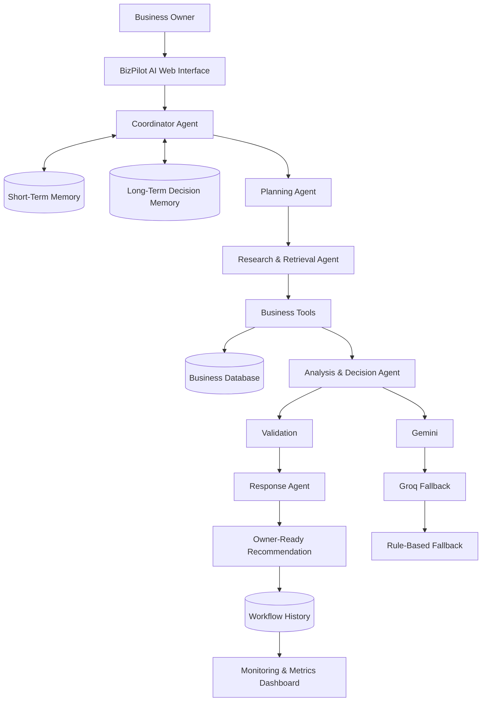

# 🤖 BizPilot AI — Explainable Multi-Agent Business Decision Assistant

### Infosys Springboard Internship Project — Milestones 1, 2, 3 & 4

**BizPilot AI** is an explainable AI-powered decision assistant designed for small retail businesses. It helps business owners make better decisions by analyzing products, sales, expenses, customer feedback, business performance, and configured local weather information.

The system uses a **multi-agent architecture powered by LangGraph**, structured agent state, short-term conversation memory, long-term decision memory, workflow tracking, validation, monitoring, and deterministic fallback mechanisms.

🔗 **Live Demo:** https://bizpilot-ai-pyua.onrender.com/

🔗 **GitHub Repository:** https://github.com/VishnuKumarLH/BizPilotAI-Infosys

---

## 📌 Project Overview

Small retail businesses often have useful business data such as:

* Product and inventory information
* Sales records
* Expenses
* Customer feedback
* Business performance
* Previous business decisions
* External information such as weather

However, this information is usually stored separately, making it difficult for a business owner to quickly answer questions such as:

> "Which products should I restock?"

> "Which product should I promote?"

> "Why did you recommend this product?"

> "What did you recommend previously?"

> "How is my business performing this month?"

BizPilot AI solves this problem by combining business data with a coordinated AI workflow.

The owner asks a question in natural language, and the system determines what information is required, retrieves the relevant data, analyzes it, validates the result, and produces an easy-to-understand recommendation.

---

# 🎯 Problem Statement

Small business owners need to make frequent decisions about:

* Inventory
* Product promotion
* Sales performance
* Expenses
* Customer preferences
* Business profitability
* Weather-based opportunities

Traditional dashboards show raw numbers, but they do not always explain:

**What should I do next, and why?**

BizPilot AI provides an intelligent decision layer on top of business data.

---

# 💡 Proposed Solution

BizPilot AI works as an **AI decision assistant**.

Instead of asking the business owner to manually analyze multiple tables and reports, the owner can simply ask a natural-language question.

Example:

```text
Owner:
Which products should I restock?
```

BizPilot AI:

```text
1. Understands the request
2. Creates a plan
3. Retrieves relevant business data
4. Analyzes sales and inventory
5. Validates the decision
6. Generates an explanation
7. Stores workflow history
8. Provides the recommendation
```

This makes the decision process:

* Explainable
* Traceable
* Data-driven
* Automated
* Reusable

---

# 🏗️ System Architecture



---

# 🔄 Complete Workflow

The main BizPilot AI workflow is:

```text
Business Owner
      ↓
Natural Language Question
      ↓
Coordinator Agent
      ↓
Request Classification
      ↓
Planning Agent
      ↓
Research & Retrieval Agent
      ↓
Business Tools / Database
      ↓
Analysis & Decision Agent
      ↓
Validation
      ↓
Response Agent
      ↓
Explainable Recommendation
      ↓
Workflow History + Metrics
```

---

# 🤖 Multi-Agent System

BizPilot AI uses four main agents.

## 1. Coordinator Agent

The Coordinator is the central controller.

Responsibilities:

* Receives the user request
* Understands the type of question
* Loads relevant memory
* Coordinates the agent workflow
* Maintains structured workflow state
* Controls the execution flow

Example:

```text
User:
Which products should I restock?

Coordinator:
This is an inventory and sales decision.
Required information:
- Current stock
- Recent sales
- Product information
```

---

## 2. Planning Agent

The Planning Agent determines what needs to be done.

Example:

```text
Request:
Which products should I restock?

Plan:
1. Retrieve product inventory
2. Retrieve recent sales
3. Identify low-stock products
4. Compare sales velocity
5. Rank products
6. Prepare recommendation
```

The plan is stored as structured workflow state.

---

## 3. Research & Retrieval Agent

This agent collects the information required by the plan.

It can retrieve:

* Products
* Inventory
* Sales
* Expenses
* Customer feedback
* Weather information
* Previous decisions

The agent does not call every tool unnecessarily.

It selects tools based on the user's request.

---

## 4. Analysis & Decision Agent

This agent analyzes the retrieved information and creates the business decision.

Example:

```text
Product: Wireless Mouse

Current Stock: 5
Recent Sales: 25
Sales Trend: High
Stock Risk: High

Decision:
Restock Wireless Mouse

Reason:
High recent sales combined with low current
inventory indicates a high probability of stockout.
```

---

## 5. Response Agent

The Response Agent converts the structured decision into a clear explanation for the business owner.

Instead of returning raw database information:

```text
Stock = 5
Sales = 25
```

it produces:

```text
I recommend restocking the Wireless Mouse.

It currently has only 5 units in stock,
while 25 units were sold recently.
This indicates strong demand and a high
risk of running out of stock.
```

---

# 🧠 Memory Architecture

BizPilot AI uses different types of memory for different purposes.

## Short-Term Memory

Database tables:

```text
chat_sessions
chat_messages
```

Purpose:

Maintain recent conversation context.

Example:

```text
User:
Which product should I promote?

AI:
I recommend the Wireless Mouse.

User:
Why did you choose that?
```

The system understands that **"that"** refers to the previously recommended product.

---

## Long-Term Decision Memory

Database table:

```text
agent_memories
```

Purpose:

Store reusable historical decisions and observations.

Example:

```text
Previous Decision:
Wireless Mouse was recommended for promotion
because of strong recent sales and positive feedback.
```

Later the user can ask:

```text
What did you recommend previously for low-stock products?
```

BizPilot AI can search previous decisions.

---

## Workflow History

Tables:

```text
agent_workflow_runs
agent_execution_log
tool_call_logs
```

Purpose:

Record what happened during each workflow.

Stored information includes:

* Workflow ID
* User request
* Workflow status
* Agent execution
* Agent duration
* Tool calls
* Tool duration
* Retrieved evidence
* Decision
* Validation warnings
* Fallback usage
* Final response

This makes the system **traceable and observable**.

---

# 🛡️ Explainability

A major goal of BizPilot AI is that the system should not simply provide an answer.

It should explain:

```text
What was decided?
        ↓
Why was it decided?
        ↓
What data was used?
        ↓
Which agents participated?
        ↓
Which tools were used?
        ↓
Were there any warnings?
```

This makes the AI recommendation easier for a business owner to understand and trust.

---

# 🔧 Business Data Modules

BizPilot AI provides modules for managing:

### Products

Store:

* Product name
* Category
* Price
* Stock
* Product details

### Sales

Store:

* Product
* Quantity
* Revenue
* Sale date

### Expenses

Store:

* Expense category
* Amount
* Description
* Date

### Customer Feedback

Store:

* Customer feedback
* Rating
* Product
* Feedback date

These records become the data foundation for the AI decision engine.

---

# 🌦️ Weather-Based Decisions

BizPilot AI also supports configured local weather information.

Current configured location:

```text
Madurai, Tamil Nadu, India
```

Example:

```text
User:
What offer should I provide based on Madurai weather?
```

The workflow can retrieve weather information and combine it with business/product information to generate a suitable recommendation.

---

# 🧮 Business Calculations

The system can also handle calculation-based requests.

Example:

```text
Calculate profit margin for revenue 50000
and expenses 32000.
```

The system calculates:

```text
Profit = Revenue - Expenses

Profit = ₹50,000 - ₹32,000

Profit = ₹18,000
```

It can then present the result in an understandable business format.

---

# 🔁 AI Provider Fallback System

BizPilot AI uses multiple levels of AI fallback.

```text
Gemini
   ↓
If unavailable
   ↓
Groq
   ↓
If unavailable
   ↓
Verified Rule-Based Fallback
```

This improves reliability.

Environment variables:

```env
PRIMARY_AI_PROVIDER=gemini
FALLBACK_AI_PROVIDER=groq
ENABLE_RULE_BASED_FALLBACK=true
```

Gemini and Groq API keys are optional because the system includes deterministic fallback logic.

---

# 📊 Milestone 1

## Foundation and Basic Business System

Milestone 1 focused on building the foundation of BizPilot AI.

Implemented:

* Flask application
* Basic web interface
* Product management
* Sales management
* Expense management
* Feedback management
* PostgreSQL/SQLite database support
* Basic CRUD operations

The objective was to establish the core business data platform.

---

# 📊 Milestone 2

## Extended Business Management

Milestone 2 extended the basic application with additional business functionality.

Implemented:

* Improved dashboard
* Business data management
* Inventory-related functionality
* Better user interface
* Database integration
* Business performance information
* Foundation for AI decision support

This milestone established the data layer required for intelligent recommendations.

---

# 📊 Milestone 3

## Multi-Agent Decision Engine

Milestone 3 introduced the AI decision-making architecture.

Implemented:

* LangGraph workflow
* Coordinator-controlled execution
* Planning Agent
* Research & Retrieval Agent
* Analysis & Decision Agent
* Response Agent
* Structured agent state
* Pydantic outputs
* Tool selection
* AI provider fallback
* Short-term memory
* Long-term decision memory

The system moved from a traditional CRUD application to an **AI-powered decision assistant**.

---

# 📊 Milestone 4

## Production Decision Engine, Automation and Observability

Milestone 4 focused on making the system production-ready.

Implemented:

* Real LangGraph workflow
* Workflow lifecycle tracking
* Agent execution logging
* Tool execution logging
* Workflow history
* Monitoring APIs
* Dashboard metrics
* Memory APIs
* Authenticated REST APIs
* Health endpoint
* Automated workflow support
* Docker deployment
* PostgreSQL production configuration
* Render deployment readiness
* Google Cloud Run compatibility
* Gemini → Groq → rule-based fallback

---

# 📈 Observability Dashboard

The Agent History / Monitoring dashboard provides information such as:

### Workflow Metrics

* Total workflows
* Successful workflows
* Partial workflows
* Failed workflows
* Average workflow duration
* Fallback usage

### Agent Metrics

* Agent execution count
* Agent success/failure
* Average agent duration

### Tool Metrics

* Tool usage
* Tool failures
* Average tool duration

This allows developers and mentors to understand how the multi-agent system is performing.

---

# 🔐 Authentication and Security

BizPilot AI includes authentication and ownership protection.

Protected areas include:

* Business data
* Workflow APIs
* Memory APIs
* Metrics APIs
* Agent history
* Tool information

The system ensures that authenticated users can access only their own business information.

The health endpoint is intentionally public:

```text
GET /api/health
```

It returns only safe service information.

---

# 🌐 REST API

## Decision Center

```text
GET  /
POST /chat/send
```

Used for the main AI decision assistant.

## Agent Workflow API

```text
POST /api/agent/run
GET  /api/agent/workflows
GET  /api/agent/workflows/<workflow_id>
```

## Observability API

```text
GET /api/health
GET /api/metrics
GET /api/workflows/<workflow_id>/timeline
GET /api/workflows/<workflow_id>/tools
GET /api/workflows/<workflow_id>/agents
```

## Memory API

```text
GET /api/memory
GET /api/memory/search
```

Memory deletion and clearing endpoints are also available.

## Business APIs

```text
/products/
/sales/
/expenses/
/feedback/
```

## Weather

```text
GET /tools/weather
```

## Authentication

```text
/auth/
```

---

# 🗄️ Database Architecture

Production database:

```text
PostgreSQL
```

Development/testing:

```text
SQLite
```

Important data areas include:

```text
Users
   │
   ├── Products
   ├── Sales
   ├── Expenses
   ├── Feedback
   │
   ├── Chat Sessions
   │     └── Chat Messages
   │
   ├── Agent Memories
   │
   ├── Workflow Runs
   │     └── Agent Execution Logs
   │
   ├── Tool Call Logs
   │
   └── Workflow Templates
```

Database migrations are managed using:

```text
Flask-Migrate
Alembic
```

---

# 🛠️ Technology Stack

| Technology          | Purpose                            |
| ------------------- | ---------------------------------- |
| Python 3.11         | Backend programming                |
| Flask               | Web application framework          |
| Flask-SQLAlchemy    | Database ORM                       |
| Flask-Migrate       | Database migrations                |
| PostgreSQL          | Production database                |
| SQLite              | Lightweight development/testing    |
| LangGraph           | Multi-agent workflow orchestration |
| LangChain           | AI workflow integration            |
| Gemini              | Primary AI provider                |
| Groq                | Fallback AI provider               |
| Pydantic            | Structured validation              |
| APScheduler         | Workflow scheduling                |
| Gunicorn            | Production WSGI server             |
| Docker              | Containerization                   |
| Render              | Web deployment                     |
| Google Cloud Run    | Cloud deployment readiness         |
| HTML/CSS/JavaScript | Frontend                           |
| Flasgger            | API documentation                  |

---

# 🚀 Deployment

## Local Setup

### 1. Clone the repository

```powershell
git clone https://github.com/VishnuKumarLH/BizPilotAI-Infosys.git
cd BizPilotAI-Infosys
```

### 2. Create virtual environment

```powershell
python -m venv .venv
```

### 3. Activate environment

```powershell
.\.venv\Scripts\Activate.ps1
```

### 4. Install dependencies

```powershell
python -m pip install -r requirements.txt
```

### 5. Configure environment

```powershell
Copy-Item .env.example .env
```

Configure the required environment variables.

### 6. Run migrations

```powershell
flask --app app db upgrade
```

### 7. Insert demo data

```powershell
python seed_data.py
```

### 8. Start application

```powershell
flask --app app run
```

Open:

```text
http://127.0.0.1:5000
```

---

# 🧪 Testing

Run the complete test suite:

```powershell
python -m pytest -q
```

The test suite uses isolated test data and mocks external AI/weather services where required.

---

# 🐳 Docker

Build:

```powershell
docker build -t bizpilot-ai .
```

Run:

```powershell
docker run --rm -p 8080:8080 --env-file .env -e PORT=8080 bizpilot-ai
```

The container uses Gunicorn and binds to:

```text
0.0.0.0:${PORT}
```

which makes it compatible with cloud deployment platforms.

---

# ☁️ Render Deployment

BizPilot AI is deployed using Render.

### Production URL

🔗 https://bizpilot-ai-pyua.onrender.com/

### Deployment Architecture

```text
GitHub Repository
       ↓
Render Blueprint
       ↓
Docker Build
       ↓
Flask + Gunicorn
       ↓
PostgreSQL
       ↓
BizPilot AI
```

The deployment uses:

* Docker
* Gunicorn
* PostgreSQL
* Flask-Migrate
* Environment variables
* Production configuration

Database migrations are executed before the application starts.

Demo data can be populated using:

```text
python seed_data.py
```

---

# 🔑 Demo Account

For demonstration purposes:

```text
Email: demo@stylehub.com
Password: demo123
```

> If the deployed demo database has been reset, the demo account and demo records may need to be recreated using the project's seed script.

---

# 🎬 Demo Scenarios

The following questions demonstrate the major capabilities of BizPilot AI.

### Scenario 1 — Inventory Decision

```text
Which products should I restock?
```

Demonstrates:

```text
Planning
+
Product data
+
Sales data
+
Inventory analysis
+
Decision
+
Explanation
```

---

### Scenario 2 — Explain Previous Decision

```text
Which product should I promote?
```

Then:

```text
Why did you choose that?
```

Demonstrates short-term conversation memory.

---

### Scenario 3 — Long-Term Memory

```text
What did you recommend previously for low-stock products?
```

Demonstrates reusable long-term decision memory.

---

### Scenario 4 — Business Performance

```text
How is my business performing this month?
```

Demonstrates:

```text
Sales
+
Expenses
+
Business analysis
+
Decision
```

---

### Scenario 5 — Weather-Based Recommendation

```text
What offer should I provide based on Madurai weather?
```

Demonstrates:

```text
Weather
+
Business context
+
Product information
+
Recommendation
```

---

### Scenario 6 — Calculation

```text
Calculate profit margin for revenue 50000
and expenses 32000.
```

Demonstrates tool-based calculation and business reasoning.

---

# 🔍 Example Decision Flow

For:

```text
Which products should I restock?
```

The internal workflow can be represented as:

```text
User Request
     ↓
Coordinator
     ↓
Request Classification
     ↓
Planning Agent
     ↓
Research & Retrieval Agent
     ↓
Product + Sales + Inventory Tools
     ↓
Retrieved Evidence
     ↓
Analysis & Decision Agent
     ↓
Validation
     ↓
Response Agent
     ↓
Final Recommendation
```

The workflow is also recorded for observability.

---

# 📋 Example Recommendation

Example output:

```text
Recommendation:
Restock Wireless Mouse.

Reason:
The product has low current inventory while showing
strong recent sales activity.

Evidence:
- Current stock: 5 units
- Recent sales: 25 units
- Demand level: High
- Stock risk: High

Action:
Increase inventory before the current stock is exhausted.
```

The exact values depend on the current database.

---

# 🔄 AI Reliability Strategy

BizPilot AI is designed to continue operating even when an external AI provider is unavailable.

```text
                  User Request
                       ↓
                    Gemini
                       │
              ┌────────┴────────┐
              │ Available?      │
              └────────┬────────┘
                       │ No
                       ↓
                     Groq
                       │
              ┌────────┴────────┐
              │ Available?      │
              └────────┬────────┘
                       │ No
                       ↓
             Rule-Based Fallback
                       ↓
                 Final Response
```

This prevents the complete workflow from depending on a single external AI provider.

---

# 📊 Project Outcomes

BizPilot AI demonstrates how an ordinary business management application can be extended into an intelligent decision-support system.

The project provides:

* Natural-language business interaction
* Multi-agent reasoning workflow
* Structured agent communication
* Business data retrieval
* Explainable recommendations
* Short-term conversation memory
* Long-term decision memory
* Workflow traceability
* Monitoring and observability
* AI provider fallback
* REST APIs
* Authentication
* PostgreSQL persistence
* Docker deployment
* Cloud deployment readiness

---

# 🎓 Infosys Springboard Project Mapping

| Milestone   | Major Contribution                                            |
| ----------- | ------------------------------------------------------------- |
| Milestone 1 | Basic Flask application and business modules                  |
| Milestone 2 | Extended business management and dashboard                    |
| Milestone 3 | Multi-agent AI decision engine and memory                     |
| Milestone 4 | Production workflow, automation, observability and deployment |

---

# 👨‍💻 Project Information

**Project:** BizPilot AI

**Project Type:** AI-Powered Business Decision Support System

**Domain:** Small Retail Business Decision Support

**Program:** Infosys Springboard Internship

**Milestones:** 1, 2, 3 & 4

**Backend:** Python + Flask

**AI Architecture:** Multi-Agent System + LangGraph

**Database:** PostgreSQL

**Deployment:** Render

**Cloud Readiness:** Google Cloud Run

---

# 👨‍💻 Developer

**Vishnukumar L H**

B.Sc. Computer Science

Sourashtra College, Madurai

Infosys Springboard Internship Project

---

# 📚 Documentation

Additional project documentation:

```text
docs/
├── MILESTONE_1_2_AUDIT.md
├── MILESTONE_3_ARCHITECTURE.md
├── MILESTONE_3_TEST_REPORT.md
├── MILESTONE_4_ARCHITECTURE.md
└── MILESTONE_4_DEPLOYMENT.md
```

---

# ⚠️ Scope and Limitations

* Weather recommendations currently use the configured location.
* No geocoding service is included.
* Profit calculations are business estimates based on recorded sales and expenses.
* Long-term memory currently uses transparent SQL-based text matching rather than a vector database.
* AI response quality depends partly on external AI providers.
* Rule-based fallback is provided for reliability.
* Render free-tier services may sleep after periods of inactivity.
* The system is designed as an internship/project demonstration and is not intended to replace professional financial or business auditing.

---

# 🔒 Security

Never commit secrets to GitHub.

Do not commit:

```text
.env
DATABASE_URL
GEMINI_API_KEY
GROQ_API_KEY
SECRET_KEY
API_KEY
```

Use environment variables for production credentials.

---

# ⭐ Project Summary

**BizPilot AI transforms business data into explainable decisions.**

Instead of only showing:

```text
Products
Sales
Expenses
Feedback
```

the system connects these data sources through a coordinated AI workflow:

```text
Business Data
      ↓
Multi-Agent Reasoning
      ↓
Evidence
      ↓
Validation
      ↓
Explainable Decision
      ↓
Business Action
```

The project demonstrates the practical application of **Python, Flask, PostgreSQL, LangGraph, multi-agent AI, memory, workflow orchestration, observability, REST APIs, Docker, and cloud deployment** in a real-world small-business decision-support scenario.
