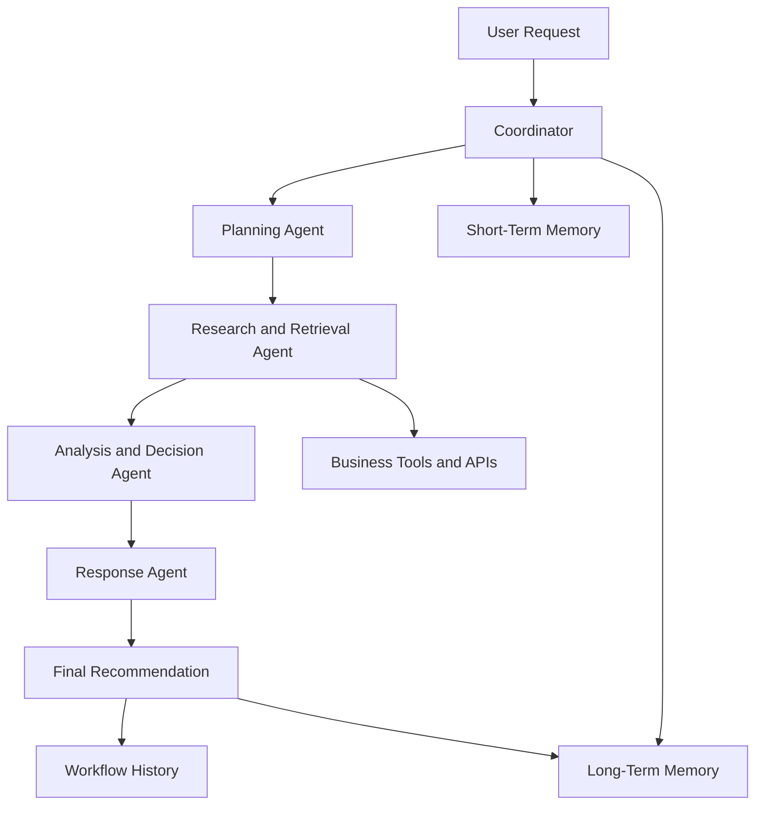

# Milestone 3 Architecture

## Overview

BizPilot AI uses a Coordinator around a four-node LangGraph. Each specialized agent receives the current `AgentWorkflowState`, reads only the fields it needs, returns a validated partial update, appends its name to the trace, and never exchanges SQLAlchemy objects through state.



## Responsibilities

### Coordinator

- Validates the public request in the route.
- Creates the workflow UUID and initial typed state.
- Loads up to the configured number of recent session messages.
- Searches evidence-backed long-term memory using SQL text matching.
- Runs the foundational deterministic classifier.
- Invokes the compiled LangGraph and times every node.
- Applies graceful node-failure defaults.
- Returns the complete state to the persistence service.

### Planning Agent

- Maps the foundational classification into one of the supported Milestone 3 categories.
- Detects follow-ups, previous-decision requests, calculations, and unsupported prompts.
- Produces a validated objective, steps, required tools, tool parameters, and expected output.

### Research and Retrieval Agent

- Invokes only tools named in the plan.
- Uses standardized tool envelopes and collects sanitized telemetry.
- Combines genuine database/API results, removes duplicate list items, and records missing information.
- Treats one tool failure as a warning so the remaining workflow can continue.

### Analysis and Decision Agent

- Reads the objective, plan, evidence, and limited context.
- Uses Gemini, then Groq, then deterministic rules for ordinary business analysis.
- Handles calculations, follow-ups, previous decisions, and unsupported scope deterministically.
- Connects decisions to evidence, adds reasons/actions/risks, and calculates transparent confidence.
- Runs final consistency and secret checks.

### Response Agent

- Formats the verified analysis for a small-business owner.
- Adds findings, actions, risks, confidence, provider, fallback, agent/tool names, workflow ID, and execution steps.
- Does not create new facts or analysis.

## Shared state

`bizpilot/graph/state.py` defines `AgentWorkflowState`. Important fields include identifiers, query/category, plan, required tools, tool results, evidence, both memory types, analysis/decision/response, agent and tool traces, provider/fallback metadata, confidence, warnings/errors, status, and timestamps.

Pydantic models validate Planning, Retrieval, Analysis, and Response Metadata outputs. `require_state_fields` provides readable boundary validation. ORM records are converted to plain dictionaries before entering state.

## Tool layer

`ToolRegistry` exposes product lookup, low/out-of-stock, sales summary, best seller, slow mover, product performance, expense summary, profit calculation, feedback retrieval/category analysis, business profile, weather, and calculator tools.

Every invocation returns:

```json
{
  "success": true,
  "tool_name": "sales_summary_tool",
  "data": {},
  "message": "Tool completed successfully.",
  "error": null
}
```

Inputs are sanitized before telemetry. `ToolCallLog` stores tool name, safe input, status, output summary, safe error label, duration, workflow ID, and timestamp.

## Memory

### Short-term

The existing `ChatSession` and `ChatMessage` models are reused rather than duplicated. `MemoryService` retrieves only the latest configured 6–10 messages (8 by default), including compact response/decision metadata needed for “Why?” follow-ups.

### Long-term

`AgentMemory` stores supported previous decisions with type, intent, title, content, summary, tags, source workflow, importance, confidence, usage, and timestamps. Search uses portable SQL `ILIKE` matching, intent, business ownership, importance, and recency. It does not claim vector or semantic search.

The `(business_id, memory_type, memory_key)` uniqueness rule updates the latest memory for an intent instead of duplicating it. Temporary errors, secrets, low-confidence output, follow-ups, and unsupported responses are not saved.

## Provider fallback and invalid output

1. Gemini is attempted with the configured retry count.
2. Groq is attempted if Gemini is missing, unavailable, misconfigured, or returns invalid structured output.
3. The deterministic Decision Agent produces an evidence-backed result if neither provider succeeds.
4. One conservative JSON-object extraction repair is allowed before a provider result is rejected.
5. The user sees a simple fallback explanation; keys and raw stack traces are never placed in the response.

## Confidence and validation

Confidence begins at 1.00. A missing required tool or context source subtracts 0.15, no evidence subtracts 0.15, Groq subtracts 0.10, rule fallback subtracts 0.15, and warnings apply a bounded reduction. The model/rule confidence caps the calculated score. The UI rounds to a whole percentage.

Validation requires a decision, a confidence value from 0 to 1, internally consistent profit arithmetic, no raw exception markers, and no recognized provider-secret patterns.

## Persistence and APIs

`WorkflowService` saves the user message, assistant response, `AgentWorkflowRun`, five agent step records, tool logs, and deduplicated long-term memory in one database transaction.

- `POST /api/agent/run`
- `GET /api/agent/workflows`
- `GET /api/agent/workflows/<workflow_id>`
- `GET /api/memory`
- `GET /api/memory/search`
- `DELETE /api/memory/<memory_id>`
- `DELETE /api/memory/session/<session_id>`

All routes require authentication and filter records by the current user.

## Example restock workflow

1. Coordinator classifies the request and loads recent/matching memory.
2. Planning selects low-stock, out-of-stock, and best-selling-product tools.
3. Research retrieves actual owned product/sales records.
4. Analysis prioritizes an out-of-stock or low-stock product using shortage and demand evidence.
5. Response presents the ranked action, limitations, confidence, agents, tools, and workflow ID.
6. The run is visible in Agent History and the supported decision updates the inventory long-term memory.

## Scope boundary

This implementation does not add background jobs, autonomous workflow execution, vector infrastructure, WebSockets, cloud deployment, microservices, or Milestones 4/5 features.
