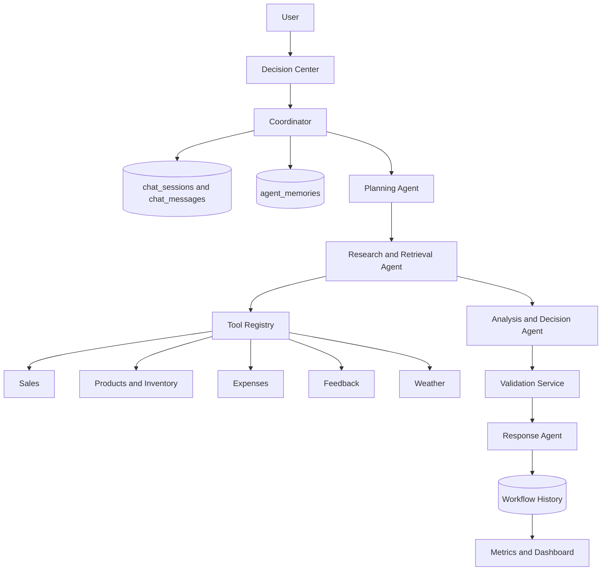

# BizPilot AI Milestone 4 Architecture

## System Architecture

BizPilot AI keeps the existing four-agent Milestone 3 design and adds lifecycle tracking, monitoring, production configuration, Docker packaging, and Cloud Run readiness.

## Agent Workflow

The Coordinator creates a workflow UUID, loads short-term and long-term memory, classifies the prompt, and invokes:

`Planning Agent -> Research and Retrieval Agent -> Analysis and Decision Agent -> Response Agent`

Milestone 4 records lifecycle events for `CREATED`, `PLANNING`, `RESEARCHING`, `ANALYZING`, `VALIDATING`, `RESPONDING`, and the terminal status.

## Coordinator Responsibilities

The Coordinator owns orchestration, state creation, memory loading, execution trace setup, graceful failure handling, and terminal status assignment. It does not fabricate tool calls or agent progress.

## Short-Term Memory Lifecycle

SHORT-TERM MEMORY uses `chat_sessions` and `chat_messages`.

Purpose: current and recent conversation context.

Example: "Why did you choose that?"

## Long-Term Memory Lifecycle

LONG-TERM MEMORY uses `agent_memories`.

Purpose: reusable historical business decisions and observations.

Example: "What did you recommend previously for low-stock products?"

## Workflow History

WORKFLOW HISTORY uses `agent_workflow_runs`, `agent_execution_log`, and `tool_call_logs`.

Purpose: traceability and observability of previous workflow executions.

## Tool Execution Lifecycle

The Research Agent selects tools from the plan. The registry records sanitized input, status, output summary, safe error message, duration, and timestamp. Tool failures are isolated and can produce partial workflows when useful evidence remains.

## Workflow Persistence

`WorkflowService` persists the assistant message, workflow run, agent logs, tool logs, and useful long-term memory in one transaction. Memory creation remains selective and deduplicated.

## Error Handling

Tool errors return safe messages. Unexpected agent failures are converted to guarded fallback outputs. API responses avoid stack traces and secrets.

## Validation

The Analysis and Decision Agent calls `validate_analysis` after analysis. Validation checks decision presence, evidence sufficiency, confidence bounds, secret leakage, raw exception leakage, and calculation consistency.

## API Architecture

Existing APIs are preserved. Milestone 4 adds `/api/health`, `/api/metrics`, `/api/workflows/<workflow_id>/timeline`, `/api/workflows/<workflow_id>/tools`, and `/api/workflows/<workflow_id>/agents`.

## Dashboard Monitoring

Agent History shows workflow totals, success rate, partial and failed counts, fallback usage, agent execution counts, tool call counts, failures, and average durations from stored logs.

## Docker Architecture

The Docker image installs dependencies, copies the app, and runs Gunicorn on `0.0.0.0:${PORT}`.

## Cloud Run Architecture

Cloud Run should run the Docker image and connect to persistent PostgreSQL through `DATABASE_URL`.

## Database Architecture

Production uses PostgreSQL. Tests and lightweight local demonstrations can still use SQLite.

## Security

Authenticated workflow, metrics, memory, and business routes enforce current-user ownership. `.env` is ignored. Health checks expose booleans and service names, not secret values.

## Testing

The test suite covers existing CRUD/auth/chat/agent behavior plus Milestone 4 health, metrics, lifecycle persistence, timeline, and ownership checks.
